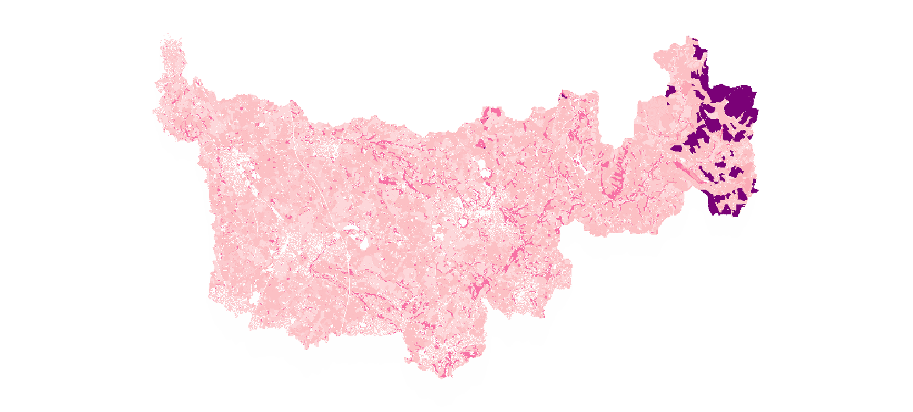

## Welcome
EcoservR is a tool for mapping natural capital assets and ecosystem services. It is a re-write of [Ecoserv-GIS](https://www.nature.scot/snh-research-report-954-ecoserv-gis-v33-toolkit-mapping-ecosystem-services-gb-scale) and is currently being developed and tested at Liverpool John Moores University in collaboration with [Natural Capital Solutions](http://www.naturalcapitalsolutions.co.uk/), [Forest Research](forestresearch.gov.uk/), and the [Cheshire Wildlife Trust](https://www.cheshirewildlifetrust.org.uk/) as part of a [Defra](https://www.gov.uk/government/organisations/department-for-environment-food-rural-affairs) test and trial for the new Environmental Land Management System (ELMS).

### Jump to...

internal links to sections on the page
+ [The Ecoserv approach](#the-ecoserv-approach)
+ [Environmental baseline](#environmental-baseline)
+ [Ecosystem services](#ecosystem-services)
+ [Applications](#applications)
+ [EcoservR release](#ecoservr-release)
+ [Get in touch](#get-in-touch)

  

# The Ecoserv approach

EcoservR, and Ecoserv-GIS before it, is a toolkit that ...................

Motivation for re-writing in R

For use in England, eventually Great Britain

  

# Environmental baseline

Description and image

## Datasets

list of datasets used in baseline

## Generating a baseline 
brief description of processing steps

## Habitat classification

When all the desired datasets have been added to the basemap, a rule-based classification step assigns a habitat code to each polygons. Currently, the datasets with the ability to inform this classification are OS MasterMap, OS (Open) Greenspace, Priority Habitat Inventory, CROME, and CORINE. Other rules based on polygon size also inform the classification.

.... Phase 1 code... future compatibility with UK HAB

# Ecosystem services

Description and list of the services we cover 

## Capacity

principles behind capacity

  

  
  
  

## Demand 

principles behind demand

# Applications

## ELMS Test and Trial
some text here

## Liverpool City Region
some text here

## Cheshire work
some text here

# EcoservR release

We are working towards a beta-release of the toolkit as a series of R scripts in late August 2020. 

  

# Get in touch

Questions or feedback? Please get in touch with us at ecoservR *at* gmail.com

